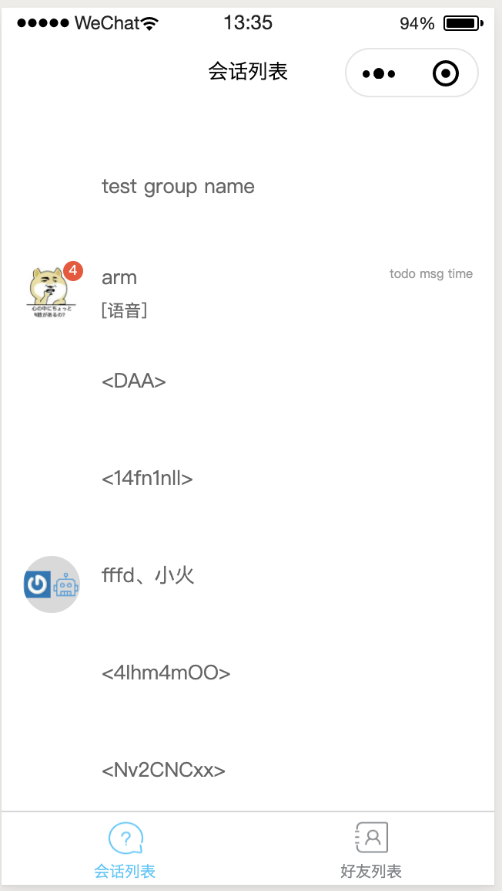
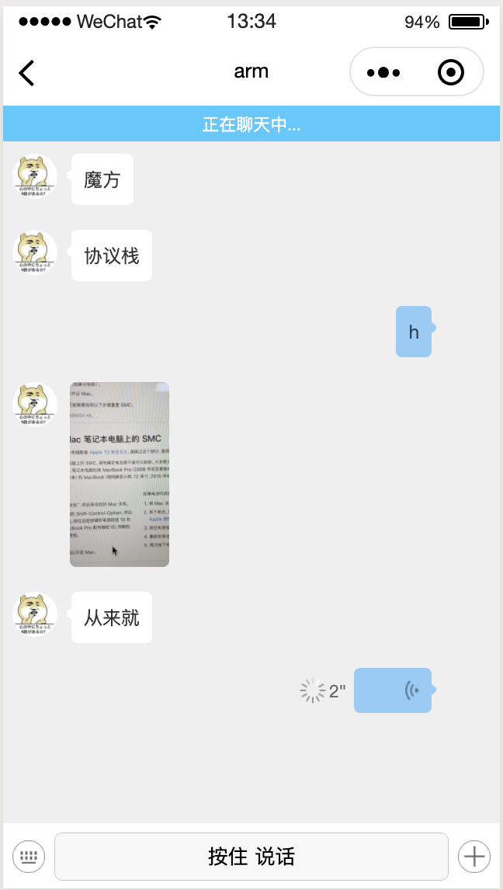
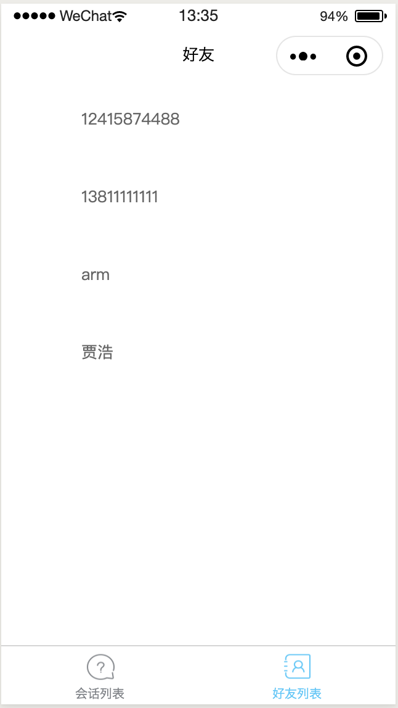

## 野火IM解决方案

野火IM是一套跨平台、核心功能开源的即时通讯解决方案，主要包含以下内容。

| 仓库                                                         | 说明                                                    | 备注 |
| ------------------------------------------------------------ | ------------------------------------------------------- | ---- |
| [android-chat](https://github.com/wildfirechat/android-chat) | 野火IM Android SDK源码和App源码                       |可以很方便地进行二次开发，或集成到现有应用当中      |
| [ios-chat](https://github.com/wildfirechat/ios-chat)         | 野火IM iOS SDK源码和App源码                            |可以很方便地进行二次开发，或集成到现有应用当中      |
| [pc-chat](https://github.com/wildfirechat/pc-chat)           | 基于[Electron](https://electronjs.org/)开发的PC平台应用 |      |
| [wx-chat](https://github.com/wildfirechat/wx-chat)           | 野火IM微信小程序SDK源码和Demo源码 | 可很方便地集成到微信小程序中     |
| [server](https://github.com/wildfirechat/server)             | IM server                                               |      |
| [app server](https://github.com/wildfirechat/app_server)     | 应用服务端                                          |      |
| [robot_server](https://github.com/wildfirechat/robot_server) | 机器人服务端                                        |      |
| [push_server](https://github.com/wildfirechat/push_server)   | 推送服务器                                              |      |
| [docs](https://github.com/wildfirechat/docs)                 | 野火IM相关文档，包含设计、概念、开发、使用说明          |      | |


## 开发配置
1. nodejs v10.16.3
2. npm 6.9.0


## 开发
0. 特别说明，由于尚未添加获取登录验证码的功能，大家开发测试时，可以用过野火IM Android端或者iOS端获取验证码。
1. npm install
2. 微信开发者工具 --> 工具 --> 构建 npm
3. 微信开发者工具 --> 工具 --> 编译

## 说明

本工程为野火IM微信小程序SDK和Demo的源码，目前项目正在活跃开发中。如果遇到问题，特别是返回```errorCode = 22```，请微信联系：wfchat


### 联系我们

> 商务合作请优先采用邮箱和我们联系。技术问题请到[野火IM论坛](http://bbs.wildfirechat.cn/)发帖交流。

1. heavyrain.lee  邮箱: heavyrain.lee@wildfirechat.cn  微信：wildfirechat
2. imndx  邮箱: imndx@wildfirechat.cn  微信：wfchat

### 问题交流

1. 如果大家发现bug，请在GitHub提issue
2. 其他问题，请到[野火IM论坛](http://bbs.wildfirechat.cn/)进行交流学习
3. 微信公众号


> 强烈建议关注我们的公众号。我们有新版本发布或者有重大更新会通过公众号通知大家，另外我们也会不定期的发布一些关于野火IM的技术介绍。

## 应用截图




## 贡献
欢迎提交pull request，一起打造一个更好的开源IM。

## 鸣谢
1. [wechat-im](https://github.com/unmagic/wechat-im) 本项目UI和即时通讯部分功能，基于此项开发，感谢作者。作者的项目和博客都特别棒，值得大家去学习。
2. [protoBufferForWechat](https://github.com/Zhang19910325/protoBufferForWechat) 感谢此项目，让在微信小程序中使用protobuf成为了可能。

如果有什么地方侵犯了您的权益，请联系我们删除🙏🙏🙏

## 案例参考

todo

## 原始项目README
[wechat-im README](./README-org.md)

## License

1. Under the MIT license. See the [LICENSE](https://github.com/wildfirechat/mars/blob/firechat/LICENSE) file for details.
2. Under the 996ICU License. See the [LICENSE](https://github.com/996icu/996.ICU/blob/master/LICENSE) file for details.
